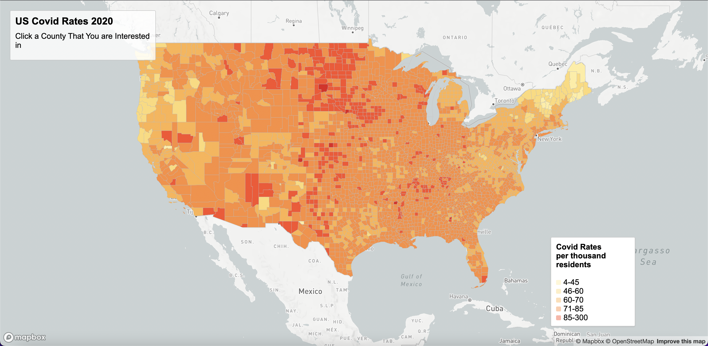
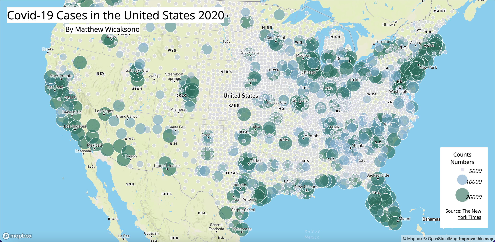

# USCovidCases2020
This file contain the introduction to the project name with its introduction, links to the map, screenshots, the primary functions, libraries in use, data sources, credit, acknowledgment, and other necessary information.

**Introduction**

This project maps COVID-19 2020 cases and rates in the United States through two kind of thematic maps. One is a choropleth map and the other is a proportional symbol map.

[Covid Rates in the United States 2020 - Choropleth Map](http://127.0.0.1:5500/map1.html)

[Covid Rates in the United States 2020 - Proportional Symbol Map](http://127.0.0.1:5500/map2.html)

**Data sources, resources, tools**

The [New York Times](https://github.com/nytimes/covid-19-data/blob/43d32dde2f87bd4dafbb7d23f5d9e878124018b8/live/us-counties.csv) gathered data to track Covid trends.

Covid case rates calculation was from [2018 ACS 5-year estimates](https://data.census.gov/cedsci/table?g=0100000US%24050000&d=ACS%205-Year%20Estimates%20Data%20Profiles&tid=ACSDP5Y2018.DP05&hidePreview=true).

US county shapefiles from [U.S. Census Bureau](https://www.census.gov/geographies/mapping-files/time-series/geo/carto-boundary-file.html).

Lab [Data](https://github.com/jakobzhao/geog458/tree/master/labs/lab03) processed by Steven Bao.

[Mapbox Javascript API](https://docs.mapbox.com/mapbox-gl-js/api/) guides to make the maps.

Step-by-step how to create [choropleth](https://github.com/jakobzhao/geog495/tree/main/labs/lab04) maps.

Step-by-step how to create [proportional](https://github.com/jakobzhao/geog458/tree/master/labs/lab03) maps.

[QGIS 3.16.15](https://qgis.org/en/site/) convert shapefile to GEOJSON.

[Visual Studio Code](https://code.visualstudio.com/) to edit the code.
